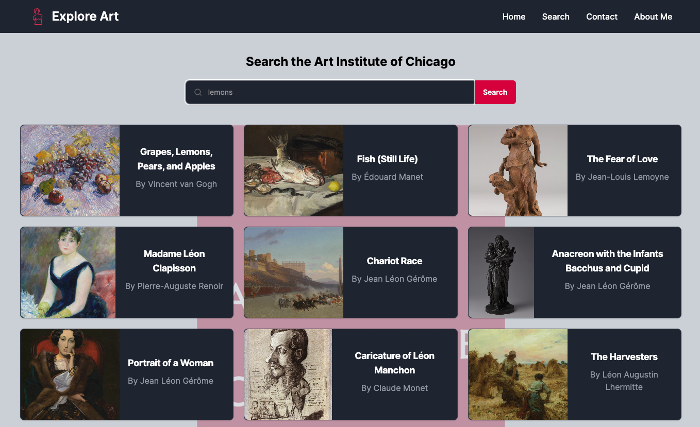

# Explore Art

## Description

In Explore Art, I'm delving into the Art Institute of Chicago's API with React and Next.js, aiming to create an immersive digital experience that seamlessly showcases the museum's extensive collection. Users are able to search the public domain images available through the Art Institute's API and then view hi-resolution images of each piece.

## Screenshot

## Built With

- React
- Next.js
- JavaScript
- Tailwind CSS
- HTML

## Credits

- [Sculpture icons created by Freepik - Flaticon](https://www.flaticon.com/free-icons/sculpture)
- [Art Institute of Chicago API](https://api.artic.edu/docs/#introduction)
  